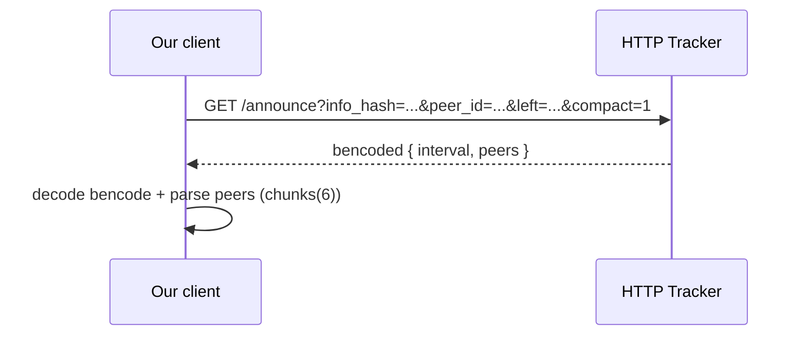
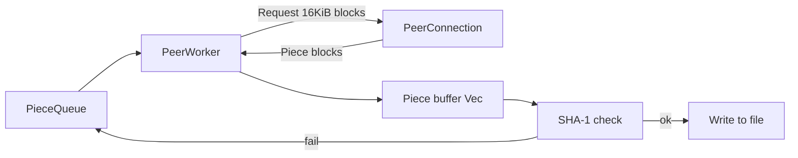

# BitTorrent Client in Rust — 15 minutes

**Audience:** C#/.NET developers

**Goal:** explain how BitTorrent works step-by-step and how it’s implemented in this Rust project

**Code map (clickable):**
- Commands / learning steps: [src/main.rs](../src/main.rs)
- Bencode: [src/bencode.rs](../src/bencode.rs)
- Metainfo (`.torrent`): [src/torrent/metainfo.rs](../src/torrent/metainfo.rs)
- Tracker: [src/tracker/client.rs](../src/tracker/client.rs)
- Peer protocol: [src/peer/connection.rs](../src/peer/connection.rs), [src/peer/message.rs](../src/peer/message.rs)
- Download pipeline: [src/download/worker.rs](../src/download/worker.rs)
- Magnet + metadata: [src/torrent/magnet.rs](../src/torrent/magnet.rs), [src/peer/metadata.rs](../src/peer/metadata.rs)
## Agenda (15 minutes)

- 1) BitTorrent glossary (90 seconds)
- 2) Bencode and `.torrent`
- 3) Tracker announce
- 4) Peer protocol: handshake + messages
- 5) Pieces/Blocks + SHA‑1
- 6) Magnet + `ut_metadata`
- 7) Rust deep dive (multiple slides)
- 8) Memory + why CodeCrafters

## 1) What a BitTorrent client actually does

One end-to-end flow (torrent):
- Read `.torrent`
- Compute `info_hash`
- Get peers from the tracker (`announce`)
- Connect to a peer over TCP
- Download blocks → assemble pieces
- Verify SHA‑1
- Write to disk

Where this is wired together:
- [src/main.rs](../src/main.rs)

## 2) BitTorrent glossary (minimal)

- `.torrent` (metainfo): announce URL + `info` dictionary
- Bencode: `int/string/list/dict`
- `info_hash`: SHA‑1(bencoded `info`) → swarm identity
- Tracker: HTTP endpoint that returns peers for an `info_hash`
- Peer: another client; TCP + peer wire protocol
- Piece: a big chunk of the file; integrity-checked with SHA‑1
- Block (chunk): a sub-range of a piece, commonly 16KiB
- Handshake: first exchange that confirms the same `info_hash`
- BEP‑10 + `ut_metadata`: fetching `info` via peers when starting from a magnet link

(From here: every step has a “go to code” link.)

## 3) Bencode: the “on-the-wire” format

The only rules you need:
- `i<number>e` → integer
- `<len>:<bytes>` → string
- `l...e` → list
- `d...e` → dictionary

In this repo:
- a small cursor-based parser that dispatches by prefix byte
- unit tests next to the parser

Code:
- [src/bencode.rs](../src/bencode.rs)

## 4) `.torrent` and `info_hash` (why this is the swarm “ID”)

BitTorrent v1 key detail:
- `info_hash` = SHA‑1 of the *bencoded* `info` dictionary
- if you encode it differently (e.g. key order), you get a different hash

Code:
- [src/torrent/metainfo.rs](../src/torrent/metainfo.rs)

## 5) Tracker announce (simple)

We do an HTTP GET with:
- `info_hash` (percent-encoded bytes)
- `peer_id`, `port`, `left`, `compact=1`

We get back:
- a bencoded dictionary
- `peers` often in compact format: each 6 bytes = 4 bytes IPv4 + 2 bytes port

Code:
- [src/tracker/client.rs](../src/tracker/client.rs)
- URL encoding: [src/utils/url.rs](../src/utils/url.rs)
## 5a) Tracker announce — diagram

## 6) Peer protocol: handshake

Handshake format:
- `<pstrlen><pstr><reserved><info_hash><peer_id>`

What we verify:
- `pstr == "BitTorrent protocol"`
- `info_hash` matches

Code:
- Handshake bytes: [src/peer/message.rs](../src/peer/message.rs)
- TCP connect + read handshake: [src/peer/connection.rs](../src/peer/connection.rs)

## 7) Peer protocol: messages and framing

Framing:
- 4 bytes (big-endian) length prefix
- then message id + payload

Big-endian anchor:
- `u32::from_be_bytes(...)` in [src/peer/connection.rs](../src/peer/connection.rs)

Message types:
- `Interested/Unchoke/Request/Piece/...` in [src/peer/message.rs](../src/peer/message.rs)

## 8) Pieces/Blocks: how downloading works (and why 16KiB)

Flow:
- take the next piece from a queue
- send `request` for a block (≤16KiB)
- fill a piece buffer
- verify SHA‑1 of the piece
- write to file

Code:
- pipeline: [src/download/worker.rs](../src/download/worker.rs)
- SHA‑1 helper: [src/utils/hash.rs](../src/utils/hash.rs)

## 8a) Pieces/Blocks — diagram

## 9) Hashes (which SHA‑1 is where)

Two important hashes:
- `info_hash` — swarm identity (SHA‑1 of bencoded `info`)
- `piece hash` — per-piece integrity (SHA‑1 of piece bytes)

Code:
- `info_hash` computation: [src/torrent/metainfo.rs](../src/torrent/metainfo.rs)
- piece verification: [src/download/worker.rs](../src/download/worker.rs)
- SHA‑1 function: [src/utils/hash.rs](../src/utils/hash.rs)

## 10) Magnet + `ut_metadata`: why and how

Problem:
- a magnet link often contains `info_hash` + tracker(s), but not the `info` dictionary

Solution:
- connect to a peer that supports extensions (BEP‑10)
- request metadata via `ut_metadata` in 16KiB pieces
- assemble `info` bytes and build metainfo

Code:
- magnet parsing: [src/torrent/magnet.rs](../src/torrent/magnet.rs)
- extension handshake payload: [src/peer/extension.rs](../src/peer/extension.rs)
- metadata fetch: [src/peer/metadata.rs](../src/peer/metadata.rs)

## 11) Rust deep dive (1/4): project structure + tests

What to notice as a C# developer:
- Modules are the “unit of architecture” (think namespaces + files/folders)
- Unit tests can live next to code (fast feedback for protocol parsing)

Where to look:
- high-level “task steps”: [src/main.rs](../src/main.rs)
- in-file tests (bencode, tracker): [src/bencode.rs](../src/bencode.rs), [src/tracker/client.rs](../src/tracker/client.rs)

Practical takeaway for .NET:
- tighten the edit/compile/test loop (especially for parsing and protocol work)

## 12) Rust deep dive (2/5): enums + exhaustive `match` (discriminated unions)

Why this matters:
- Many Rust designs start with `enum` + `match`
- `match` is exhaustive: the compiler forces you to handle every variant

Code anchors (enums you can show quickly):
- Peer message IDs: [src/peer/message.rs](../src/peer/message.rs)
- Peer events coming from the reader thread: [src/peer/connection.rs](../src/peer/connection.rs)
- Magnet topics (`xt=...`) parsed as an enum: [src/torrent/magnet.rs](../src/torrent/magnet.rs)

.NET note:
- Modern C# pattern matching + switch expressions are *very* close in spirit
- C# still lacks first-class discriminated unions; you usually need extra boilerplate (e.g., class hierarchies / generators / libraries)

## 13) Rust deep dive (3/5): `Result`/`Option` instead of exceptions/null
Key differences:
- errors are values; `?` is the “propagate if Err” operator
- `Option` makes “may be missing” explicit

Code:
- magnet parsing uses `Option` + `Result` patterns: [src/torrent/magnet.rs](../src/torrent/magnet.rs)

.NET analogy (here only):
- `Result<T, E>` feels like “exceptions, but explicit in the signature”
- `Option<T>` feels like “Nullable, but for any T and enforced everywhere”

## 14) Rust deep dive (4/5): iterators + closures (LINQ feel)
What to notice:
- chaining `.map/.filter/.chunks` is very close to LINQ
- often fewer allocations: you transform views/iterators instead of lists

Code anchors:
- `chunks(6)` to parse compact peers: [src/tracker/client.rs](../src/tracker/client.rs)
- `chunks(20)` to split piece hashes: [src/torrent/metainfo.rs](../src/torrent/metainfo.rs)

.NET takeaway:
- this pushes you toward streaming and bounded memory by default

## 15) Rust deep dive (5/5): ownership, concurrency, traits, macros
Ownership/borrowing:
- forces clear boundaries: who owns buffers/files/connections

RAII and locks:
- locks are released at end of scope (guard drop)
- example: file write under `Mutex<File>`: [src/download/worker.rs](../src/download/worker.rs)

Traits vs `dyn trait`:
- `trait` ≈ interface, often monomorphized (static dispatch)
- `dyn trait` ≈ interface via vtable (dynamic dispatch; small overhead + less inlining)
- example: global logger handler `Box<dyn LogHandler>`: [src/utils/log.rs](../src/utils/log.rs)

Macros:
- logging macros: [src/utils/log.rs](../src/utils/log.rs)

## 16) Memory: your measurement and what it means

Your numbers:
- peak ~12 MB
- private ~1 MB

Interpretation:
- a lot of the working set may be non-private (shared libs, file-backed pages)
- OS page cache can raise “visible” memory without increasing private heap
- the design is bounded: big buffers exist only where necessary

Main buffers in code:
- piece buffer sized to the piece: [src/download/worker.rs](../src/download/worker.rs)
- metadata buffer sized to `info`: [src/peer/metadata.rs](../src/peer/metadata.rs)

## 17) CodeCrafters: why this learning format worked

- Learning is easier via concrete problems: bytes, endianness, timeouts, partial reads
- Step-by-step tasks keep you unblocked
- It’s faster than a “free-form” side project where scope and architecture can explode

Where the “steps” show up:
- `task N` comments and commands in [src/main.rs](../src/main.rs)

## Q&A (if we have 1–2 minutes)
